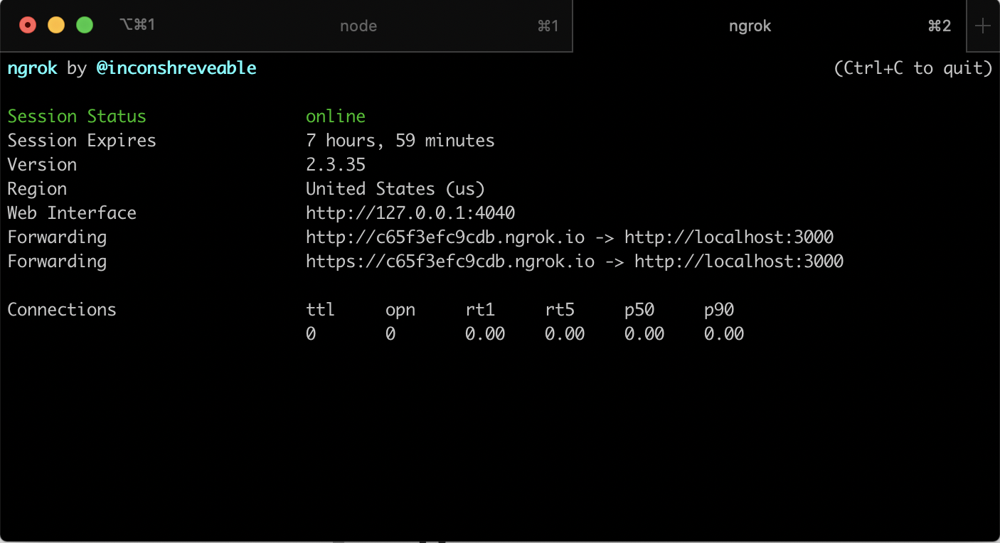
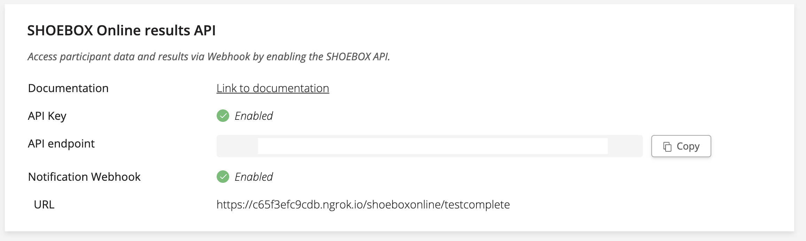

SHOEBOX Online API Quickstart - Node
===
This repository contains a server-side quickstart application that fetches results from SHOEBOX Online API when a test is complete. 

## Documentation
If you would like to read more about the SHOEBOX Online API, an OpenAPI document is [**available here**](https://editor.swagger.io/?url=https://shoeboxonline.com/us-east-1/customer_api_v1.yaml) which provides details on the available endpoints & data formats! 

We also have knowledge base articles:
* [For Admin Users: How SHOEBOX Online API works](https://help.shoebox.md/Content/SBO/Automated_Data_Transfer__API_Integration_/For_Admin_Users.htm?tocpath=SHOEBOX%C2%AE%20Online%7CAutomated%20Data%20Transfer%20with%20the%20SHOEBOX%20Online%20API%7C_____1)
* [For Developers: Getting started with SHOEBOX Online API](https://help.shoebox.md/Content/SBO/Automated_Data_Transfer__API_Integration_/For_Developers.htm?tocpath=SHOEBOX%C2%AE%20Online%7CAutomated%20Data%20Transfer%20with%20the%20SHOEBOX%20Online%20API%7C_____2)

Prerequisites
---

* A SHOEBOX Account with a SHOEBOX Online license. 
* NodeJS installed - [Get it here](https://nodejs.org/en/download/)
* Download a copy of this repository

## Setting up the Application

### Dependencies
First, we need to install our dependencies from npm. Navigate to the root of the downloaded project and run:

```bash
npm install
```
### API Access
In order to fetch results from the SHOEBOX Online API, the API URL & credentials need to be provided.

Create a configuration file for your application:
```bash
cp .env.example .env
```

Edit the `.env` file and provide the following values

* SHOEBOX_API_KEY
	* Insert your **API Key** that you've obtained from our Customer Portal in the API Keys section
* SHOEBOX_API_URL
	* Insert the **API endpoint** that is provided for your account in the Customer Portal in the API Keys section

That's it! You should be all set! Run the application using the `node` command.

```bash
node app.js
```


### Up and running

This application needs to be accessbile on the public internet in order to receive webhook requests from SHOEBOX. [Ngrok](https://ngrok.com/) is a great options for getting this done quickly.

You can grab ngrok from [their website](https://ngrok.com/) or with Homebrew

```bash
	brew cask install ngrok
```

Once you have the application running locally, in a separate terminal window, make your server available to the public internet with the following:

```bash
    ngrok http 3000
```

You should see a dynamically generated public Ngrok URL in the command window. Ngrok will now tunnel all HTTP traffic directed at this URL to your local machine at port 3000.



Copy the ngrok URL. In the SHOEBOX Portal, point the Notification Webhook URL to your local server along with the webhook path

`<YOUR-NGROK-URL>/shoeboxonline/testcomplete`



### Test the app

Test the application by navigating to your SHOEBOX Online test! Once you complete a test, you should receive a notification webhook. The application will then fetch the results from the SHOEBOX Online API and print them to the console


### Next Steps
Now that you've confirmed your application is working, it is important that you save the data that is retrieved from the SHOEBOX Online API.

**SHOEBOX Online results are available once as they are exposed through a queue**. 

Once a test is completed, results are stored on a queue. When a fetch request is executed to SHOEBOX Online, all pending results stored on the queue are returned and the queue is emptied.
